# StreamSphere — Architecture Diagrams

Simple, black-and-white architecture diagrams for the StreamSphere video streaming platform.

- **Rendered images:** `public/images/streamsphere-architecture/` (PNG, monochrome) — single source of truth, served by the site
- **Editable source:** Mermaid blocks below, plus Graphviz `.dot` files in `dot/` and Mermaid `.mmd` files in `src/`. Re-render into the public folder with: `dot -Tpng -Gdpi=140 dot/01-hld.dot -o ../public/images/streamsphere-architecture/01-hld.png`

One High-Level Design (HLD) followed by component-wise Low-Level Designs (LLD).

---

## 1. High-Level Design (HLD)

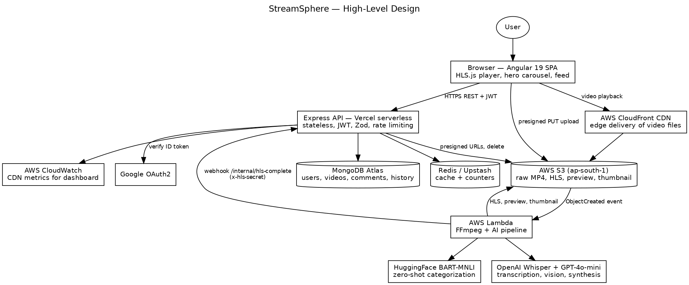

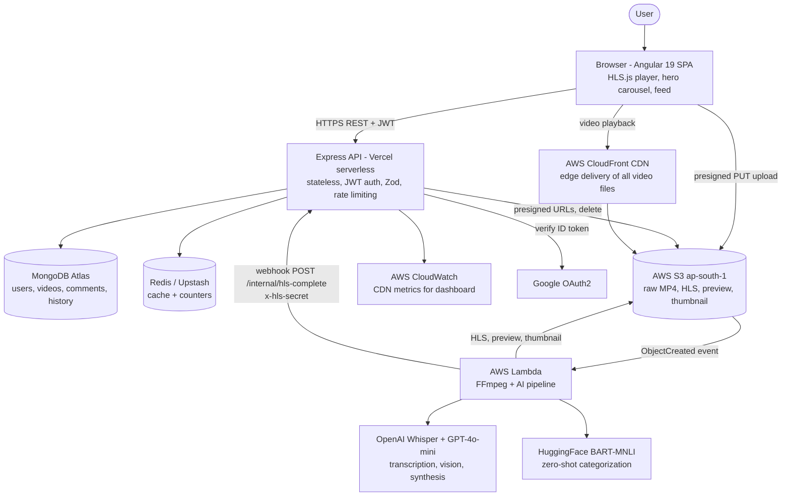
```mermaid
flowchart TD
    User([User])
    Browser["Browser - Angular 19 SPA<br/>HLS.js player, hero carousel, feed"]
    API["Express API - Vercel serverless<br/>stateless, JWT auth, Zod, rate limiting"]
    Mongo[("MongoDB Atlas<br/>users, videos, comments, history")]
    Redis[("Redis / Upstash<br/>cache + counters")]
    S3[("AWS S3 ap-south-1<br/>raw MP4, HLS, preview, thumbnail")]
    CF["AWS CloudFront CDN<br/>edge delivery of all video files"]
    CW["AWS CloudWatch<br/>CDN metrics for dashboard"]
    Lambda["AWS Lambda<br/>FFmpeg + AI pipeline"]
    HF["HuggingFace BART-MNLI<br/>zero-shot categorization"]
    OAI["OpenAI Whisper + GPT-4o-mini<br/>transcription, vision, synthesis"]
    Google["Google OAuth2"]

    User --> Browser
    Browser -->|HTTPS REST + JWT| API
    Browser -->|presigned PUT upload| S3
    Browser -->|video playback| CF
    API --> Mongo
    API --> Redis
    API -->|presigned URLs, delete| S3
    API --> CW
    API -->|verify ID token| Google
    S3 -->|ObjectCreated event| Lambda
    Lambda -->|HLS, preview, thumbnail| S3
    Lambda --> OAI
    Lambda --> HF
    Lambda -->|webhook POST /internal/hls-complete<br/>x-hls-secret| API
    CF --> S3
```

---

## 2. Upload + HLS Transcoding (LLD)

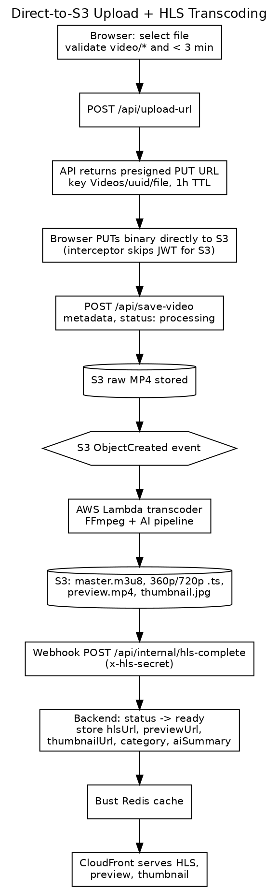

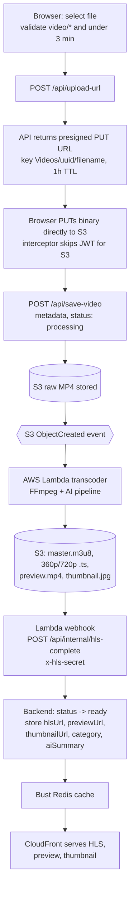
```mermaid
flowchart TD
    A["Browser: select file<br/>validate video/* and under 3 min"]
    B["POST /api/upload-url"]
    C["API returns presigned PUT URL<br/>key Videos/uuid/filename, 1h TTL"]
    D["Browser PUTs binary directly to S3<br/>interceptor skips JWT for S3"]
    E["POST /api/save-video<br/>metadata, status: processing"]
    F[("S3 raw MP4 stored")]
    G{{"S3 ObjectCreated event"}}
    H["AWS Lambda transcoder<br/>FFmpeg + AI pipeline"]
    I[("S3: master.m3u8, 360p/720p .ts,<br/>preview.mp4, thumbnail.jpg")]
    J["Lambda webhook<br/>POST /api/internal/hls-complete<br/>x-hls-secret"]
    K["Backend: status -> ready<br/>store hlsUrl, previewUrl,<br/>thumbnailUrl, category, aiSummary"]
    L["Bust Redis cache"]
    M["CloudFront serves HLS,<br/>preview, thumbnail"]

    A --> B --> C --> D --> E --> F --> G --> H
    H --> I --> J --> K --> L --> M
```

---

## 3. AI Enrichment Pipeline — all phases (LLD)

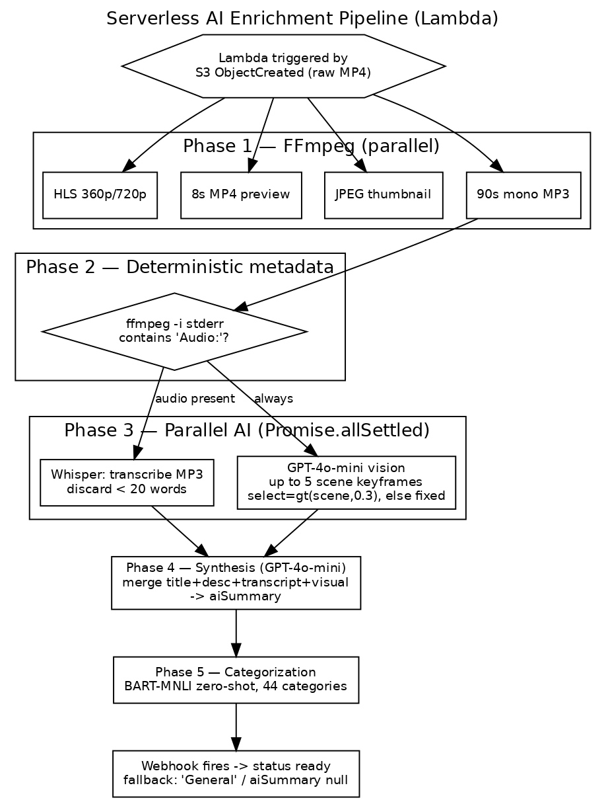

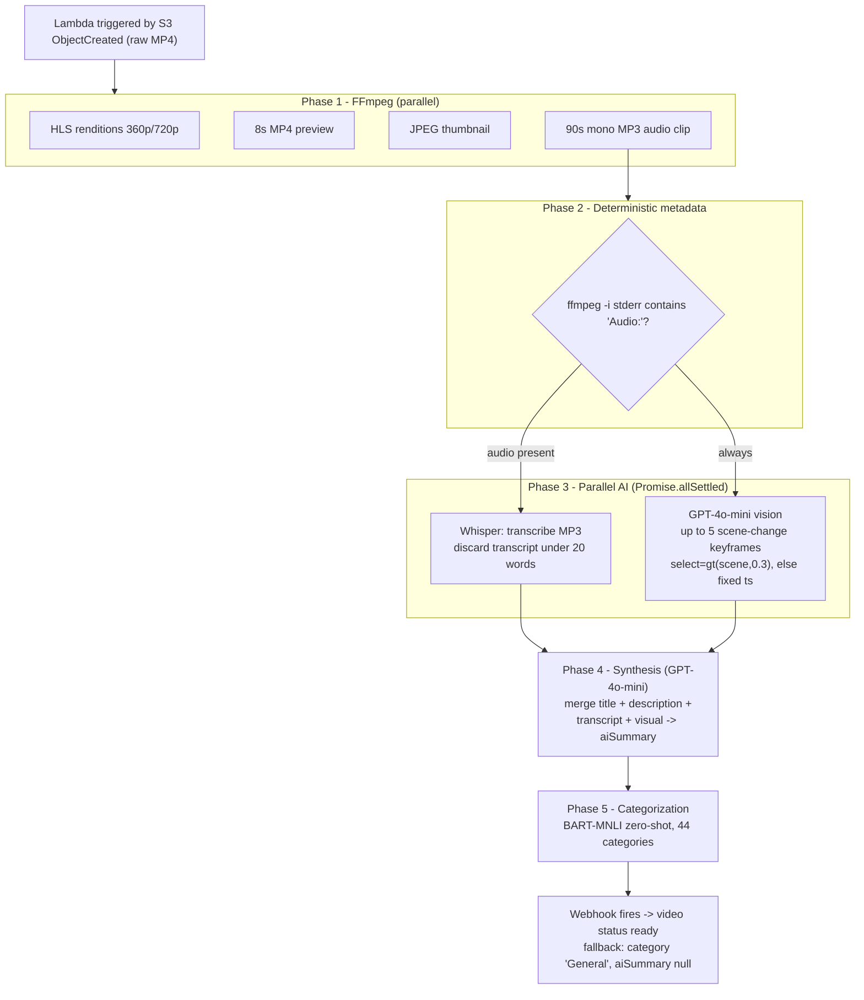
```mermaid
flowchart TD
    Start["Lambda triggered by S3 ObjectCreated (raw MP4)"]
    subgraph P1["Phase 1 - FFmpeg (parallel)"]
        F1["HLS renditions 360p/720p"]
        F2["8s MP4 preview"]
        F3["JPEG thumbnail"]
        F4["90s mono MP3 audio clip"]
    end
    subgraph P2["Phase 2 - Deterministic metadata"]
        D1{"ffmpeg -i stderr contains 'Audio:'?"}
    end
    subgraph P3["Phase 3 - Parallel AI (Promise.allSettled)"]
        W["Whisper: transcribe MP3<br/>discard transcript under 20 words"]
        V["GPT-4o-mini vision<br/>up to 5 scene-change keyframes<br/>select=gt(scene,0.3), else fixed ts"]
    end
    P4["Phase 4 - Synthesis (GPT-4o-mini)<br/>merge title + description +<br/>transcript + visual -> aiSummary"]
    P5["Phase 5 - Categorization<br/>BART-MNLI zero-shot, 44 categories"]
    End["Webhook fires -> video status ready<br/>fallback: category 'General', aiSummary null"]

    Start --> P1
    F4 --> P2
    D1 -->|audio present| W
    D1 -->|always| V
    W --> P4
    V --> P4
    P4 --> P5 --> End
```

---

## 4. Video Category Generation (LLD)

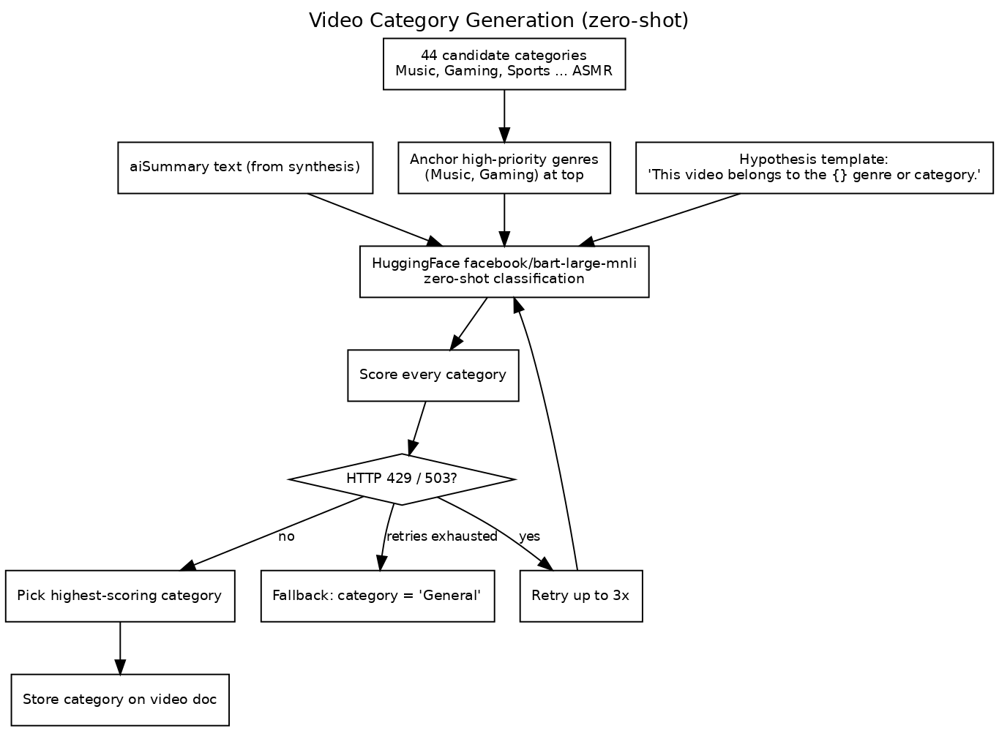

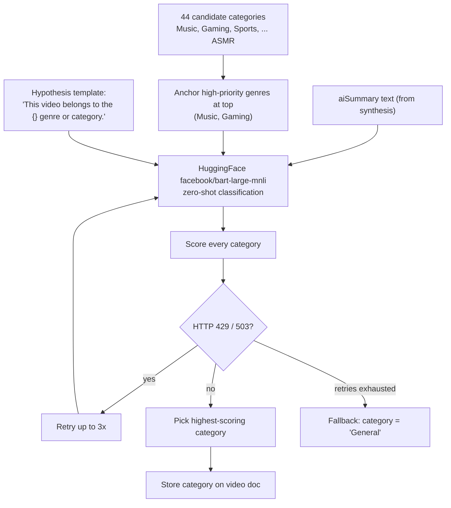
```mermaid
flowchart TD
    A["aiSummary text (from synthesis)"]
    B["44 candidate categories<br/>Music, Gaming, Sports, ... ASMR"]
    C["Anchor high-priority genres at top<br/>(Music, Gaming)"]
    D["HuggingFace facebook/bart-large-mnli<br/>zero-shot classification"]
    E["Hypothesis template:<br/>'This video belongs to the {} genre or category.'"]
    F["Score every category"]
    G{"HTTP 429 / 503?"}
    H["Retry up to 3x"]
    I["Pick highest-scoring category"]
    J["Store category on video doc"]
    K["Fallback: category = 'General'"]

    A --> D
    B --> C --> D
    E --> D
    D --> F --> G
    G -->|yes| H --> D
    G -->|no| I --> J
    G -->|retries exhausted| K
```

---

## 5. Description (aiSummary) Generation Flow (LLD)

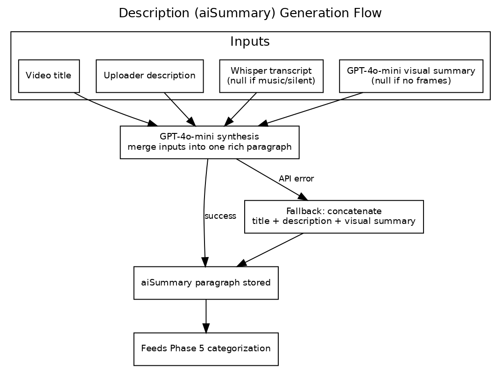

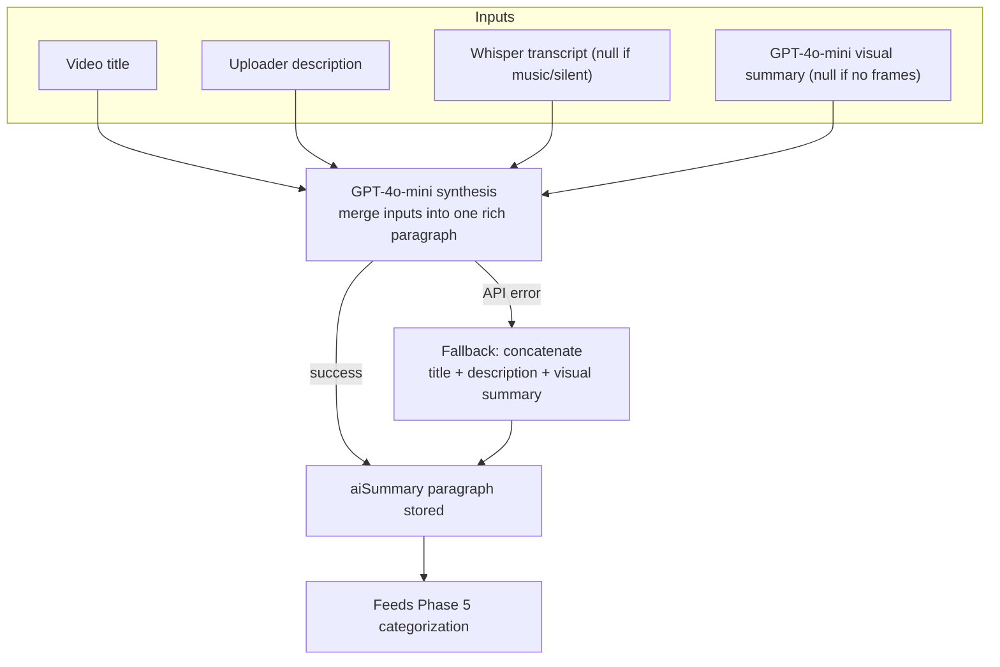
```mermaid
flowchart TD
    subgraph IN["Inputs"]
        T["Video title"]
        U["Uploader description"]
        TR["Whisper transcript (null if music/silent)"]
        VS["GPT-4o-mini visual summary (null if no frames)"]
    end
    S["GPT-4o-mini synthesis<br/>merge inputs into one rich paragraph"]
    OK["aiSummary paragraph stored"]
    FB["Fallback: concatenate<br/>title + description + visual summary"]
    NEXT["Feeds Phase 5 categorization"]

    T --> S
    U --> S
    TR --> S
    VS --> S
    S -->|success| OK
    S -->|API error| FB --> OK
    OK --> NEXT
```

---

## 6. Authentication — Google OAuth + JWT (LLD)

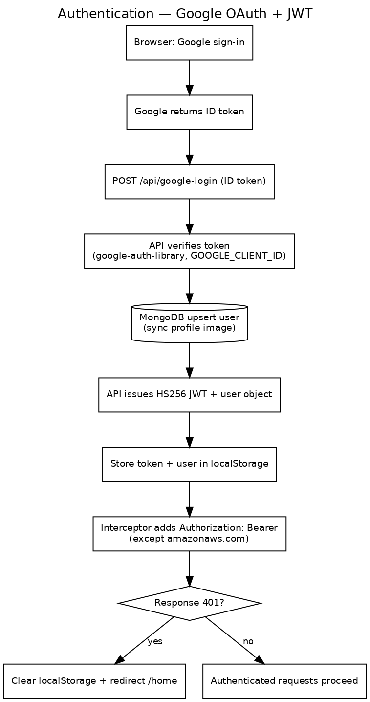

```mermaid
sequenceDiagram
    participant B as Browser (Angular)
    participant G as Google OAuth
    participant API as Express API
    participant DB as MongoDB

    B->>G: Google sign-in
    G-->>B: Google ID token
    B->>API: POST /api/google-login (ID token)
    API->>G: verify token (google-auth-library, GOOGLE_CLIENT_ID)
    G-->>API: verified payload
    API->>DB: upsert user (sync profile image)
    DB-->>API: user
    API-->>B: HS256 JWT + user object
    B->>B: store token + user in localStorage
    Note over B,API: Interceptor adds Authorization: Bearer<br/>(except amazonaws.com); 401 -> clear + redirect
```

---

## 7. Feed — Cursor Pagination + Infinite Scroll (LLD)

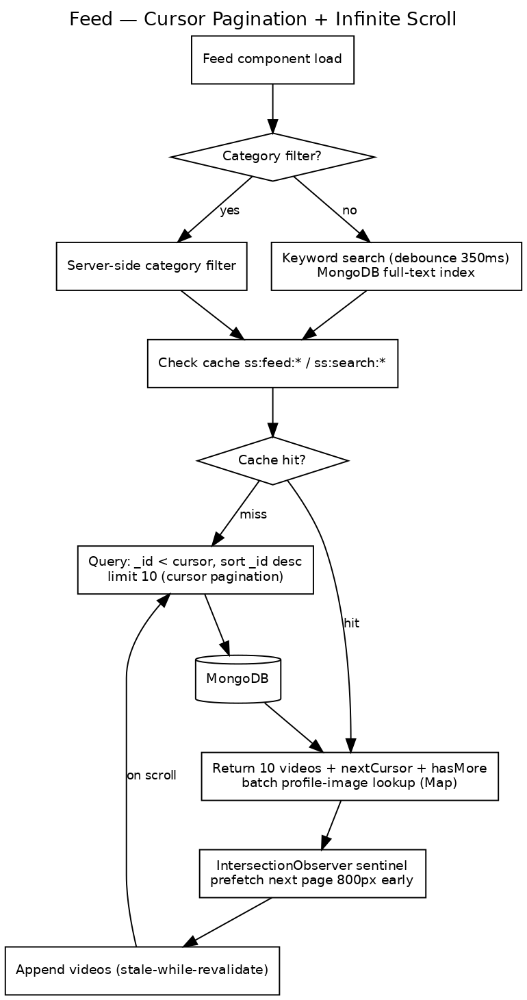

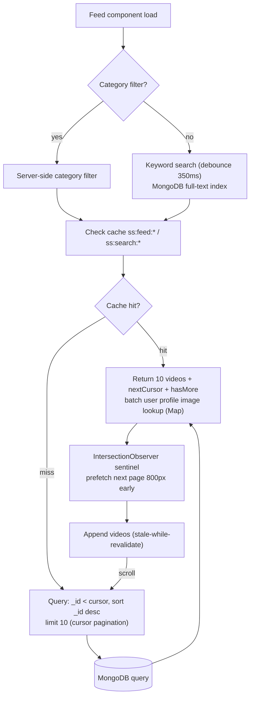
```mermaid
flowchart TD
    A["Feed component load"]
    B{"Category filter?"}
    C["Server-side category filter"]
    D["Keyword search (debounce 350ms)<br/>MongoDB full-text index"]
    E["Query: _id < cursor, sort _id desc<br/>limit 10 (cursor pagination)"]
    F["Check cache ss:feed:* / ss:search:*"]
    G{"Cache hit?"}
    H[("MongoDB query")]
    I["Return 10 videos + nextCursor + hasMore<br/>batch user profile image lookup (Map)"]
    J["IntersectionObserver sentinel<br/>prefetch next page 800px early"]
    K["Append videos (stale-while-revalidate)"]

    A --> B
    B -->|yes| C --> F
    B -->|no| D --> F
    F --> G
    G -->|hit| I
    G -->|miss| E --> H --> I
    I --> J --> K
    K -->|scroll| E
```

---

## 8. Redis Caching + Invalidation (LLD)

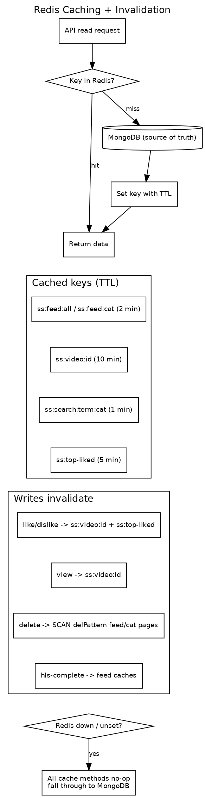

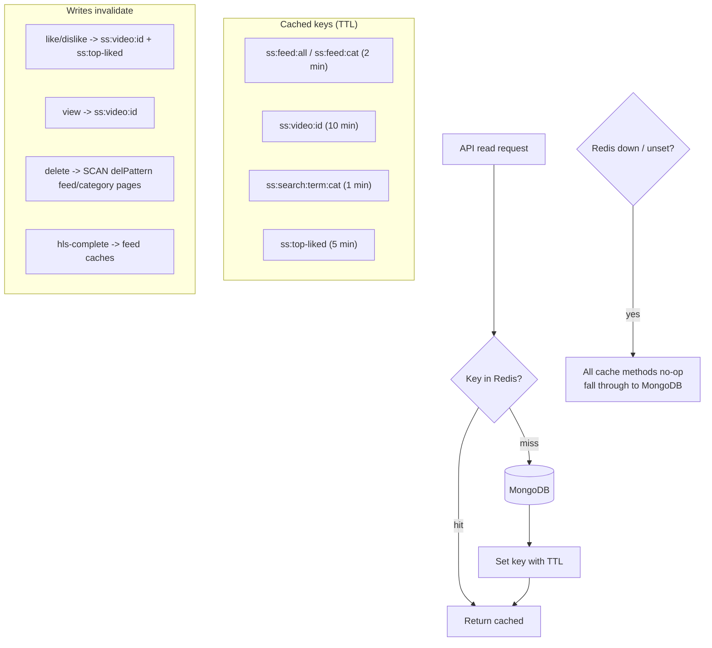
```mermaid
flowchart TD
    Req["API read request"] --> CK{"Key in Redis?"}
    CK -->|hit| Resp["Return cached"]
    CK -->|miss| Mongo[("MongoDB")] --> Set["Set key with TTL"] --> Resp

    subgraph Reads["Cached keys (TTL)"]
        R1["ss:feed:all / ss:feed:cat (2 min)"]
        R2["ss:video:id (10 min)"]
        R3["ss:search:term:cat (1 min)"]
        R4["ss:top-liked (5 min)"]
    end
    subgraph Writes["Writes invalidate"]
        W1["like/dislike -> ss:video:id + ss:top-liked"]
        W2["view -> ss:video:id"]
        W3["delete -> SCAN delPattern feed/category pages"]
        W4["hls-complete -> feed caches"]
    end
    Down{"Redis down / unset?"} -->|yes| NoOp["All cache methods no-op<br/>fall through to MongoDB"]
```

---

## 9. View Counting with Deduplication (LLD)

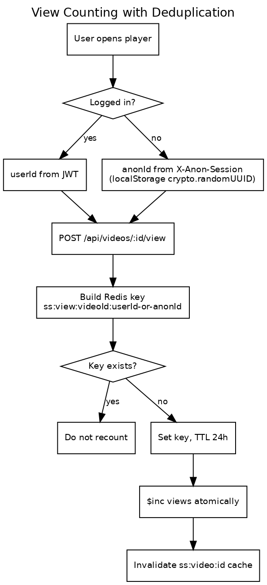

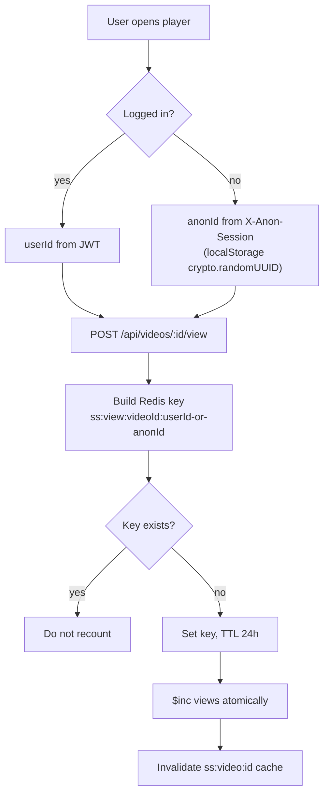
```mermaid
flowchart TD
    A["User opens player"]
    B{"Logged in?"}
    C["userId from JWT"]
    D["anonId from X-Anon-Session<br/>(localStorage crypto.randomUUID)"]
    E["POST /api/videos/:id/view"]
    F["Build Redis key<br/>ss:view:videoId:userId-or-anonId"]
    G{"Key exists?"}
    H["Do not recount"]
    I["Set key, TTL 24h"]
    J["$inc views atomically"]
    K["Invalidate ss:video:id cache"]

    A --> B
    B -->|yes| C --> E
    B -->|no| D --> E
    E --> F --> G
    G -->|yes| H
    G -->|no| I --> J --> K
```

---

## 10. Like / Dislike Toggle (LLD)

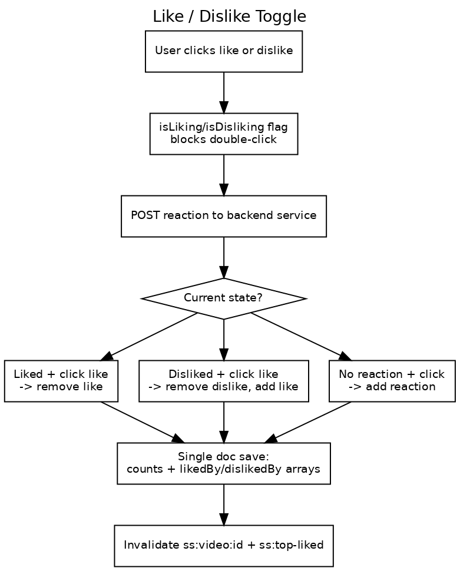

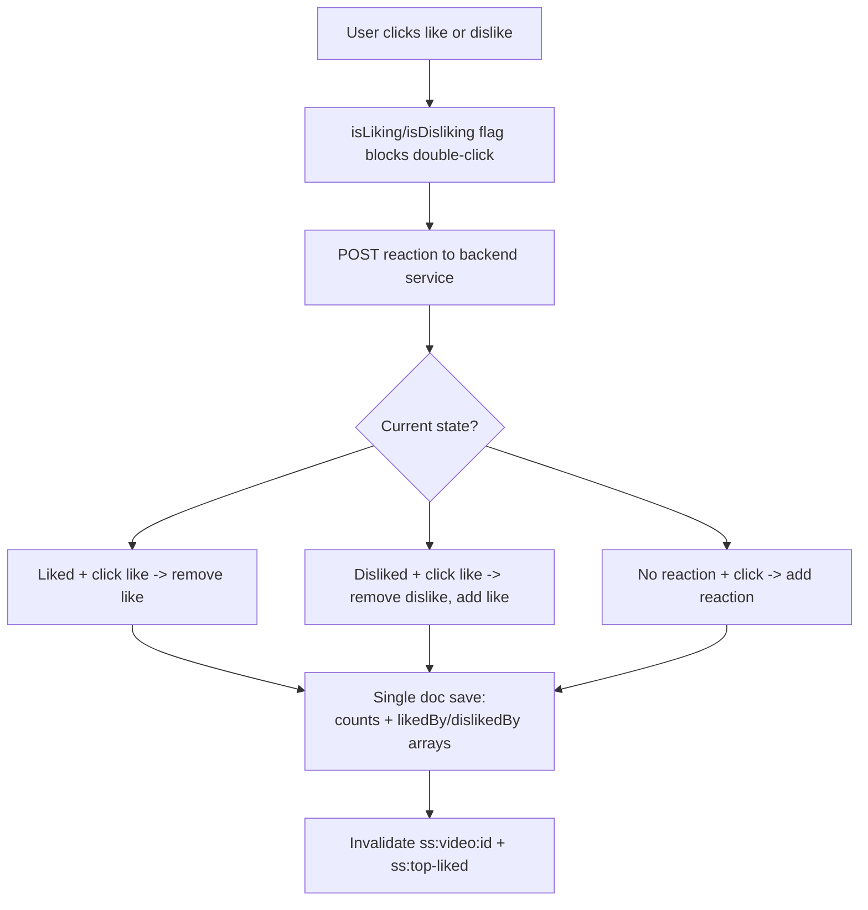
```mermaid
flowchart TD
    A["User clicks like or dislike"]
    B["isLiking/isDisliking flag blocks double-click"]
    C["POST reaction to backend service"]
    D{"Current state?"}
    E["Liked + click like -> remove like"]
    F["Disliked + click like -> remove dislike, add like"]
    G["No reaction + click -> add reaction"]
    H["Single doc save:<br/>counts + likedBy/dislikedBy arrays"]
    I["Invalidate ss:video:id + ss:top-liked"]

    A --> B --> C --> D
    D --> E --> H
    D --> F --> H
    D --> G --> H
    H --> I
```

---

## 11. Resilience & Fallbacks (LLD)

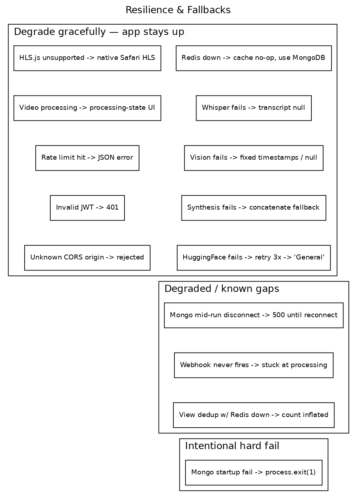

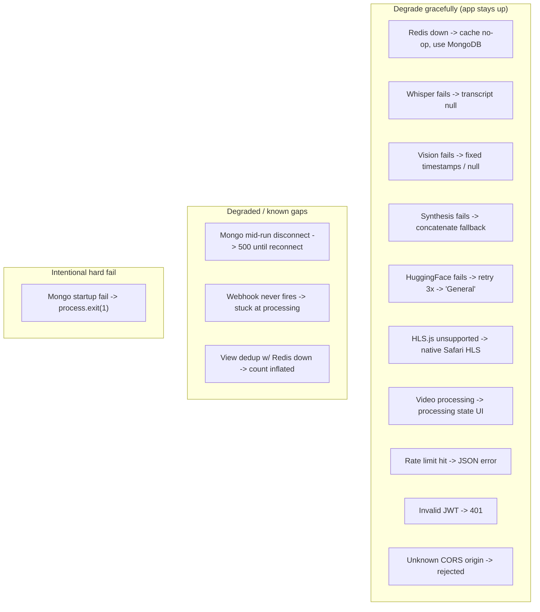
```mermaid
flowchart TD
    subgraph AppUp["Degrade gracefully (app stays up)"]
        R["Redis down -> cache no-op, use MongoDB"]
        W["Whisper fails -> transcript null"]
        V["Vision fails -> fixed timestamps / null"]
        SY["Synthesis fails -> concatenate fallback"]
        HF["HuggingFace fails -> retry 3x -> 'General'"]
        PL["HLS.js unsupported -> native Safari HLS"]
        PR["Video processing -> processing state UI"]
        RL["Rate limit hit -> JSON error"]
        JW["Invalid JWT -> 401"]
        CO["Unknown CORS origin -> rejected"]
    end
    subgraph Degraded["Degraded / known gaps"]
        MD["Mongo mid-run disconnect -> 500 until reconnect"]
        WH["Webhook never fires -> stuck at processing"]
        VC["View dedup w/ Redis down -> count inflated"]
    end
    subgraph Down["Intentional hard fail"]
        MS["Mongo startup fail -> process.exit(1)"]
    end
```
