# Argumint — Architecture Diagrams

Simple, black-and-white architecture diagrams for the Argumint real-time debate arena.

- **Rendered images:** `public/images/argumint-architecture/` (PNG, monochrome) — single source of truth, served by the site
- **Editable source:** Mermaid blocks below, plus Graphviz `.dot` files in `dot/` and Mermaid `.mmd` files in `src/`. Re-render into the public folder with: `dot -Tpng -Gdpi=140 dot/01-hld.dot -o ../../public/images/argumint-architecture/01-hld.png`

One High-Level Design (HLD) followed by component-wise Low-Level Designs (LLD).

---

## 1. High-Level Design (HLD)

The whole system at a glance — the React SPA, the Express REST API and Socket.IO server, MongoDB/Redis, the peer-to-peer WebRTC audio mesh, and the OpenAI and Razorpay integrations.

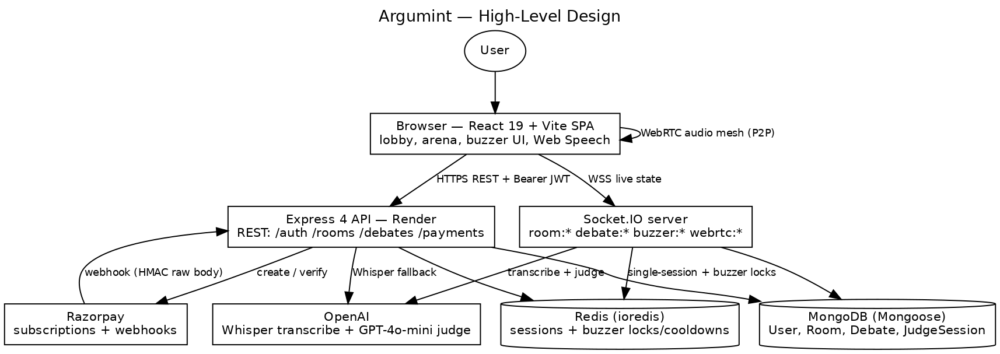

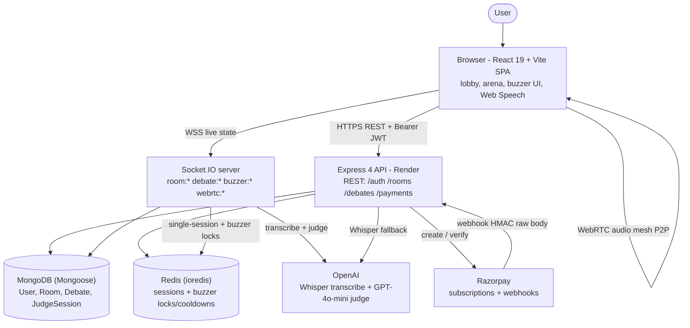
```mermaid
flowchart TD
    User([User])
    Browser["Browser - React 19 + Vite SPA<br/>lobby, arena, buzzer UI, Web Speech"]
    API["Express 4 API - Render<br/>REST: /auth /rooms /debates /payments"]
    IO["Socket.IO server<br/>room:* debate:* buzzer:* webrtc:*"]
    Mongo[("MongoDB (Mongoose)<br/>User, Room, Debate, JudgeSession")]
    Redis[("Redis (ioredis)<br/>sessions + buzzer locks/cooldowns")]
    OAI["OpenAI<br/>Whisper transcribe + GPT-4o-mini judge"]
    RZP["Razorpay<br/>subscriptions + webhooks"]

    User --> Browser
    Browser -->|HTTPS REST + Bearer JWT| API
    Browser -->|WSS live state| IO
    Browser -->|WebRTC audio mesh P2P| Browser

    API --> Mongo
    API --> Redis
    IO --> Mongo
    IO -->|single-session + buzzer locks| Redis
    IO -->|transcribe + judge| OAI
    API -->|Whisper fallback| OAI
    API -->|create / verify| RZP
    RZP -->|webhook HMAC raw body| API
```

---

## 2. Life of a Debate

End to end: create room, lobby ready-up, optional topic voting, side assignment, the chosen speaking mode, AI judging, optional human judging, and persisted results.

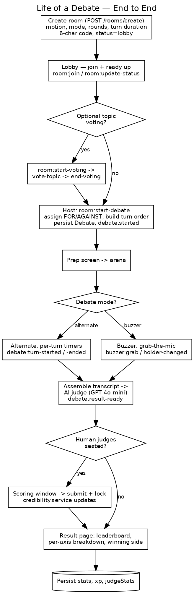

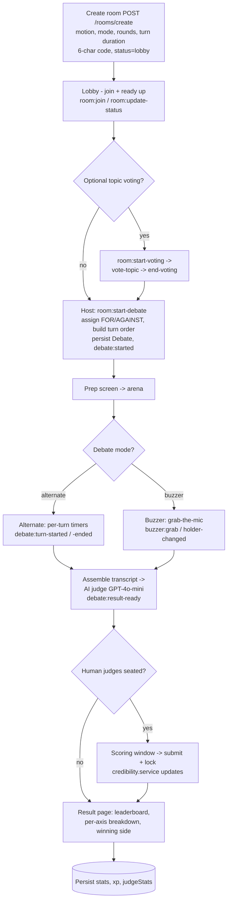
```mermaid
flowchart TD
    Create["Create room POST /rooms/create<br/>motion, mode, rounds, turn duration<br/>6-char code, status=lobby"]
    Lobby["Lobby - join + ready up<br/>room:join / room:update-status"]
    Vote{"Optional topic voting?"}
    Voting["room:start-voting -><br/>vote-topic -> end-voting"]
    Start["Host: room:start-debate<br/>assign FOR/AGAINST, build turn order<br/>persist Debate, debate:started"]
    Prep["Prep screen -> arena"]
    Mode{"Debate mode?"}
    Alt["Alternate: per-turn timers<br/>debate:turn-started / -ended"]
    Buz["Buzzer: grab-the-mic<br/>buzzer:grab / holder-changed"]
    Judge["Assemble transcript -><br/>AI judge GPT-4o-mini<br/>debate:result-ready"]
    Human{"Human judges seated?"}
    Cred["Scoring window -> submit + lock<br/>credibility.service updates"]
    Result["Result page: leaderboard,<br/>per-axis breakdown, winning side"]
    Persist[("Persist stats, xp, judgeStats")]

    Create --> Lobby --> Vote
    Vote -->|yes| Voting
    Vote -->|no| Start
    Voting --> Start
    Start --> Prep --> Mode
    Mode -->|alternate| Alt
    Mode -->|buzzer| Buz
    Alt --> Judge
    Buz --> Judge
    Judge --> Human
    Human -->|yes| Cred
    Human -->|no| Result
    Cred --> Result --> Persist
```

---

## 3. Authentication & Single Session

Login issues a Bearer JWT stored in localStorage; Redis enforces one active session per user and evicts the old socket via session:evicted when you log in elsewhere.

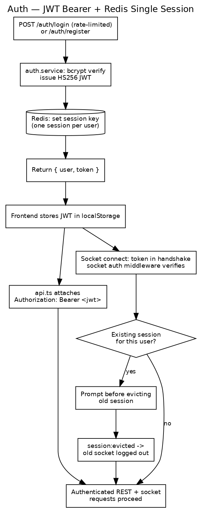

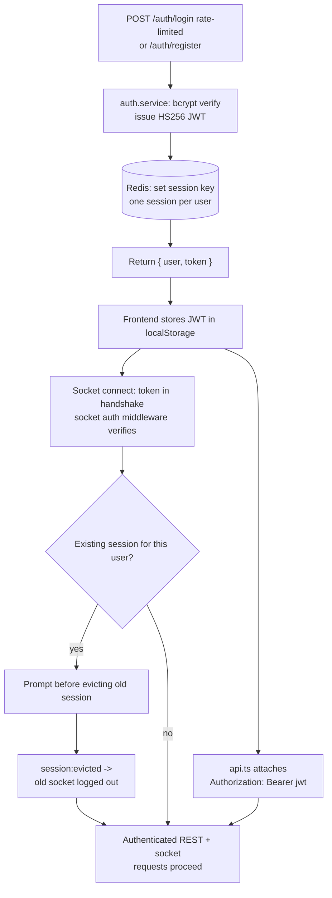
```mermaid
flowchart TD
    A["POST /auth/login rate-limited<br/>or /auth/register"]
    B["auth.service: bcrypt verify<br/>issue HS256 JWT"]
    C[("Redis: set session key<br/>one session per user")]
    D["Return { user, token }"]
    E["Frontend stores JWT in localStorage"]
    F["api.ts attaches<br/>Authorization: Bearer jwt"]
    G["Socket connect: token in handshake<br/>socket auth middleware verifies"]
    H{"Existing session for this user?"}
    I["Prompt before evicting old session"]
    J["session:evicted -><br/>old socket logged out"]
    K["Authenticated REST + socket<br/>requests proceed"]

    A --> B --> C --> D --> E --> F
    E --> G --> H
    H -->|yes| I --> J --> K
    H -->|no| K
    F --> K
```

---

## 4. Real-Time Lobby — Presence & Host Controls

Room broadcasts keep every client's participant list live; a room:get-state handshake lets a late joiner or reconnecting socket rebuild full lobby state.

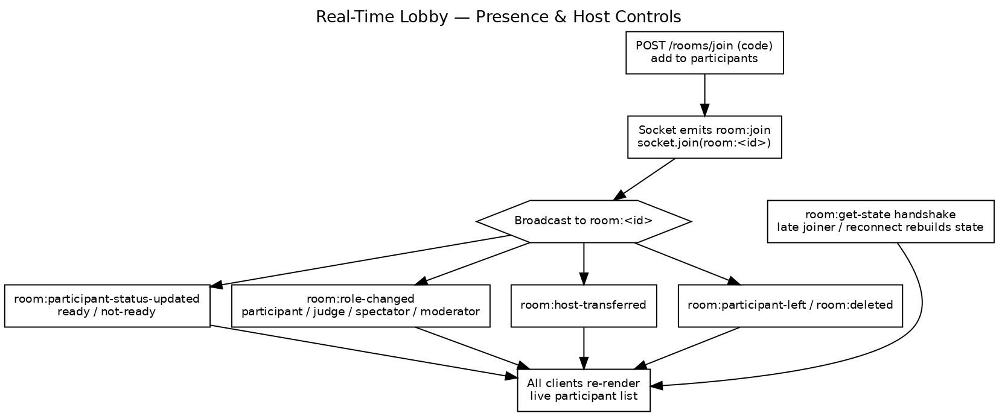

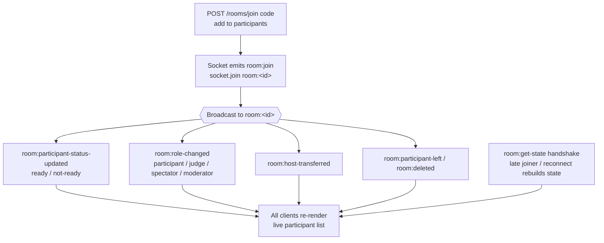
```mermaid
flowchart TD
    J["POST /rooms/join code<br/>add to participants"]
    S["Socket emits room:join<br/>socket.join room:&lt;id&gt;"]
    B{{"Broadcast to room:&lt;id&gt;"}}
    P1["room:participant-status-updated<br/>ready / not-ready"]
    P2["room:role-changed<br/>participant / judge / spectator / moderator"]
    P3["room:host-transferred"]
    P4["room:participant-left / room:deleted"]
    RS["room:get-state handshake<br/>late joiner / reconnect rebuilds state"]
    ST["All clients re-render<br/>live participant list"]

    J --> S --> B
    B --> P1
    B --> P2
    B --> P3
    B --> P4
    P1 --> ST
    P2 --> ST
    P3 --> ST
    P4 --> ST
    RS --> ST
```

---

## 5. Alternate Mode — Turn-by-Turn

The server is authoritative over turn order and timers: it emits turn-started with an endsAt, accepts the submitted argument (or times out), then advances.

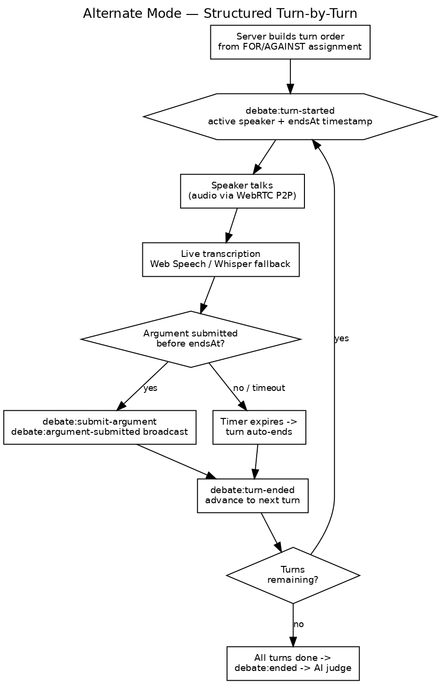

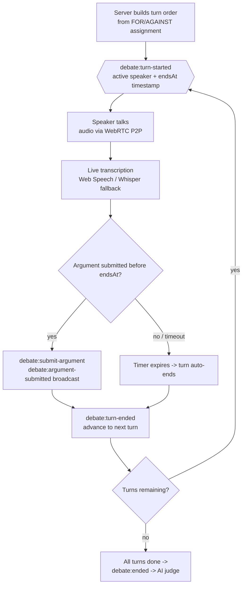
```mermaid
flowchart TD
    TO["Server builds turn order<br/>from FOR/AGAINST assignment"]
    TS{{"debate:turn-started<br/>active speaker + endsAt timestamp"}}
    SP["Speaker talks<br/>audio via WebRTC P2P"]
    TR["Live transcription<br/>Web Speech / Whisper fallback"]
    Sub{"Argument submitted before endsAt?"}
    AR["debate:submit-argument<br/>debate:argument-submitted broadcast"]
    TIM["Timer expires -> turn auto-ends"]
    TE["debate:turn-ended<br/>advance to next turn"]
    More{"Turns remaining?"}
    End["All turns done -><br/>debate:ended -> AI judge"]

    TO --> TS --> SP --> TR --> Sub
    Sub -->|yes| AR
    Sub -->|no / timeout| TIM
    AR --> TE
    TIM --> TE
    TE --> More
    More -->|yes| TS
    More -->|no| End
```

---

## 6. Buzzer Mode — Grab-the-Mic

A Redis lock makes "who holds the mic" race-free; on release or timeout a short re-grab window opens before the floor frees and the mic reopens.

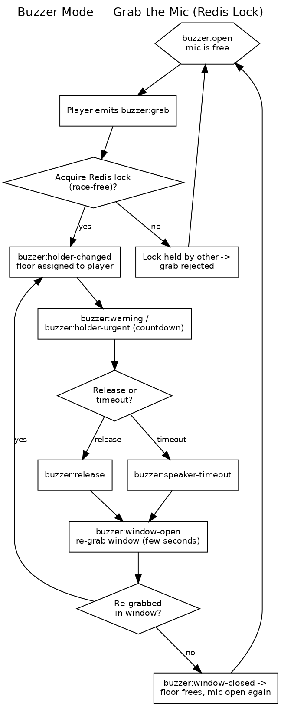

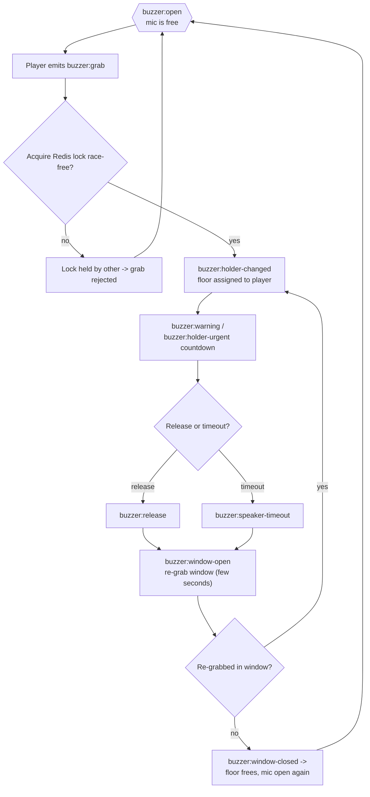
```mermaid
flowchart TD
    Open{{"buzzer:open<br/>mic is free"}}
    Grab["Player emits buzzer:grab"]
    Lock{"Acquire Redis lock race-free?"}
    Lost["Lock held by other -> grab rejected"]
    Hold["buzzer:holder-changed<br/>floor assigned to player"]
    Warn["buzzer:warning /<br/>buzzer:holder-urgent countdown"]
    Rel{"Release or timeout?"}
    Relq["buzzer:release"]
    TO["buzzer:speaker-timeout"]
    Win["buzzer:window-open<br/>re-grab window (few seconds)"]
    Wc{"Re-grabbed in window?"}
    Free["buzzer:window-closed -><br/>floor frees, mic open again"]

    Open --> Grab --> Lock
    Lock -->|no| Lost
    Lock -->|yes| Hold
    Lost --> Open
    Hold --> Warn --> Rel
    Rel -->|release| Relq
    Rel -->|timeout| TO
    Relq --> Win
    TO --> Win
    Win --> Wc
    Wc -->|yes| Hold
    Wc -->|no| Free
    Free --> Open
```

---

## 7. Live Audio — WebRTC Mesh

Socket.IO relays only SDP offers/answers and ICE candidates; the audio media itself flows directly browser-to-browser in a full peer mesh, never through the server.

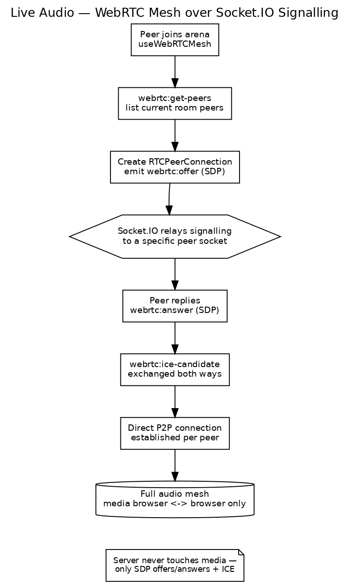

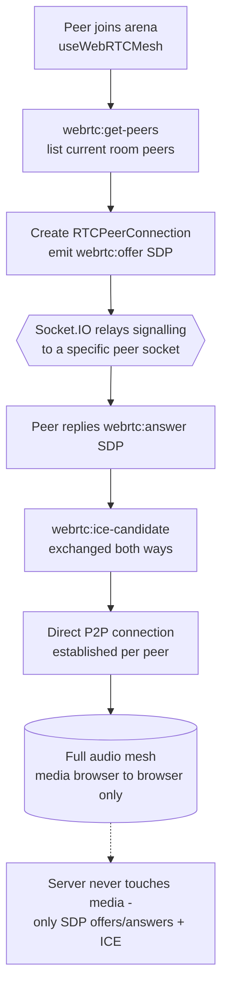
```mermaid
flowchart TD
    P["Peer joins arena<br/>useWebRTCMesh"]
    GP["webrtc:get-peers<br/>list current room peers"]
    Off["Create RTCPeerConnection<br/>emit webrtc:offer SDP"]
    Sig{{"Socket.IO relays signalling<br/>to a specific peer socket"}}
    Ans["Peer replies webrtc:answer SDP"]
    Ice["webrtc:ice-candidate<br/>exchanged both ways"]
    Conn["Direct P2P connection<br/>established per peer"]
    Mesh[("Full audio mesh<br/>media browser to browser only")]
    Note["Server never touches media -<br/>only SDP offers/answers + ICE"]

    P --> GP --> Off --> Sig
    Sig --> Ans --> Ice --> Conn --> Mesh
    Mesh -.-> Note
```

---

## 8. Speech Transcription

The browser Web Speech API is the primary path; when unsupported or failing, recorded audio falls back to the server-side OpenAI Whisper transcription, with Whisper minutes costed per debate.

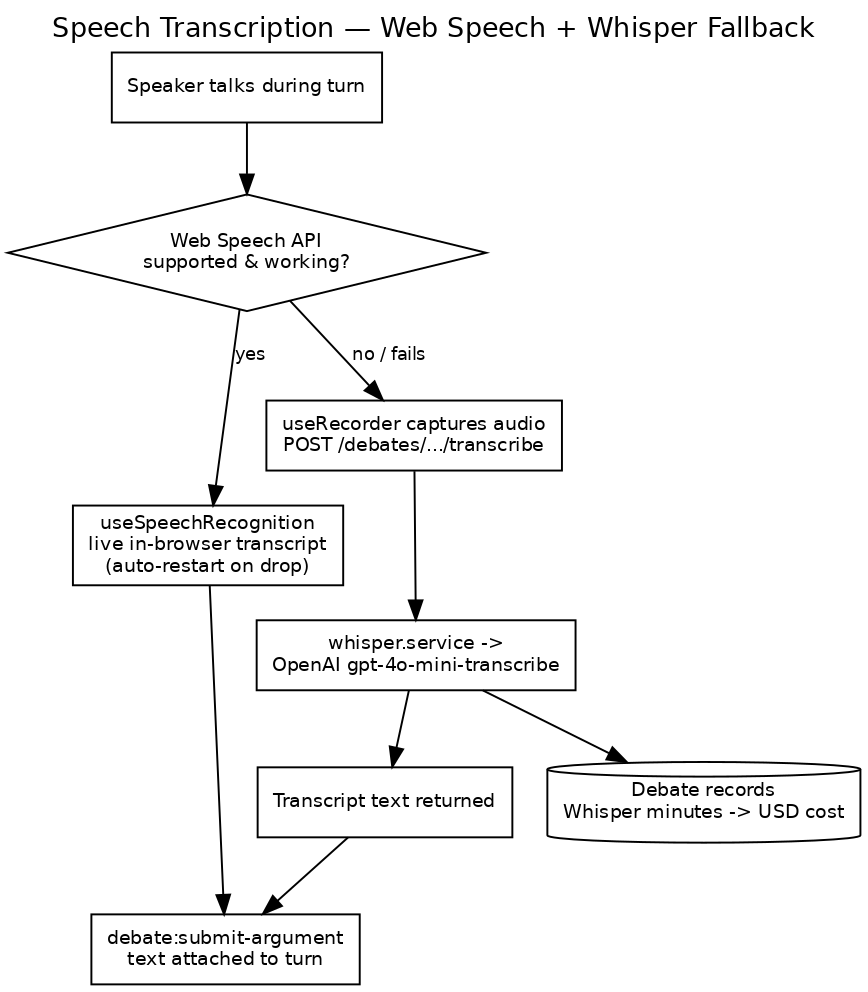

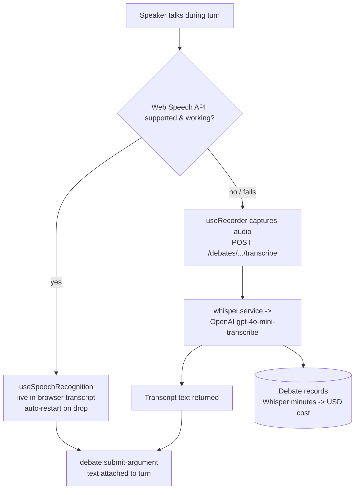
```mermaid
flowchart TD
    Spk["Speaker talks during turn"]
    WS{"Web Speech API supported & working?"}
    Live["useSpeechRecognition<br/>live in-browser transcript<br/>auto-restart on drop"]
    Rec["useRecorder captures audio<br/>POST /debates/.../transcribe"]
    Whp["whisper.service -><br/>OpenAI gpt-4o-mini-transcribe"]
    Txt["Transcript text returned"]
    Sub["debate:submit-argument<br/>text attached to turn"]
    Cost[("Debate records<br/>Whisper minutes -> USD cost")]

    Spk --> WS
    WS -->|yes| Live
    WS -->|no / fails| Rec
    Rec --> Whp --> Txt
    Live --> Sub
    Txt --> Sub
    Whp --> Cost
```

---

## 9. AI Judge — Scoring Pipeline

GPT-4o-mini scores each speaker on four 0–25 axes; the service re-computes the total as the sum of parts, clamps each axis, picks a winner, and records token usage and USD cost.

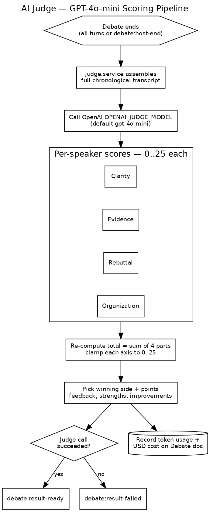

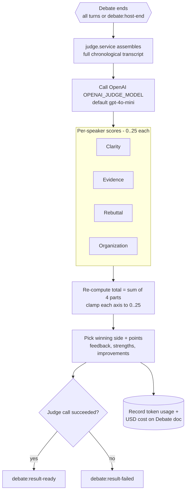
```mermaid
flowchart TD
    Trg{{"Debate ends<br/>all turns or debate:host-end"}}
    Asm["judge.service assembles<br/>full chronological transcript"]
    Call["Call OpenAI OPENAI_JUDGE_MODEL<br/>default gpt-4o-mini"]

    subgraph Axes["Per-speaker scores - 0..25 each"]
        C1["Clarity"]
        C2["Evidence"]
        C3["Rebuttal"]
        C4["Organization"]
    end

    Fix["Re-compute total = sum of 4 parts<br/>clamp each axis to 0..25"]
    Win["Pick winning side + points<br/>feedback, strengths, improvements"]
    OK{"Judge call succeeded?"}
    RR["debate:result-ready"]
    RF["debate:result-failed"]
    Cost[("Record token usage +<br/>USD cost on Debate doc")]

    Trg --> Asm --> Call --> Axes
    Axes --> Fix --> Win --> OK
    OK -->|yes| RR
    OK -->|no| RF
    Win --> Cost
```

---

## 10. Judge Credibility — 6 Pillars + EMA + Bias Cap

Each human judge's session is scored across six pillars (two need history), capped by detected bias severity, then folded into a rolling EMA credibility and written as a JudgeSession.

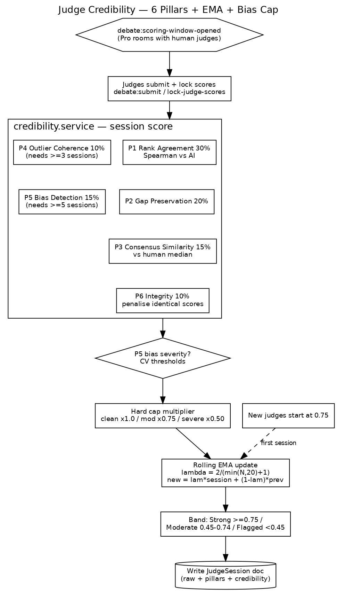

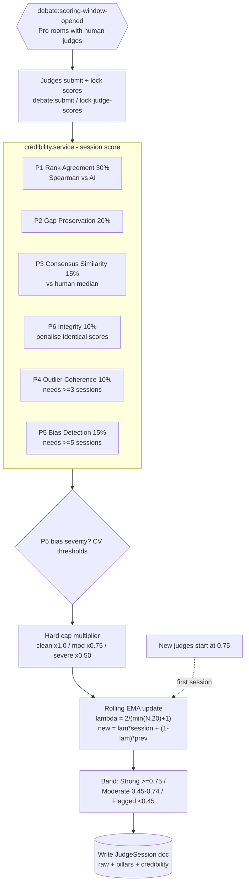
```mermaid
flowchart TD
    Open{{"debate:scoring-window-opened<br/>Pro rooms with human judges"}}
    Sub["Judges submit + lock scores<br/>debate:submit / lock-judge-scores"]

    subgraph Pillars["credibility.service - session score"]
        P1["P1 Rank Agreement 30%<br/>Spearman vs AI"]
        P2["P2 Gap Preservation 20%"]
        P3["P3 Consensus Similarity 15%<br/>vs human median"]
        P6["P6 Integrity 10%<br/>penalise identical scores"]
        P4["P4 Outlier Coherence 10%<br/>needs >=3 sessions"]
        P5["P5 Bias Detection 15%<br/>needs >=5 sessions"]
    end

    Cap{"P5 bias severity? CV thresholds"}
    Mul["Hard cap multiplier<br/>clean x1.0 / mod x0.75 / severe x0.50"]
    EMA["Rolling EMA update<br/>lambda = 2/(min(N,20)+1)<br/>new = lam*session + (1-lam)*prev"]
    New["New judges start at 0.75"]
    Band["Band: Strong >=0.75 /<br/>Moderate 0.45-0.74 / Flagged <0.45"]
    JS[("Write JudgeSession doc<br/>raw + pillars + credibility")]

    Open --> Sub --> Pillars
    Pillars --> Cap --> Mul --> EMA
    New -.->|first session| EMA
    EMA --> Band --> JS
```

---

## 11. XP & Levelling

Debating earns XP and progresses a 10-tier ladder from Novice to Grand Master via getLevelInfo — a scoring zone entirely separate from judge credibility.

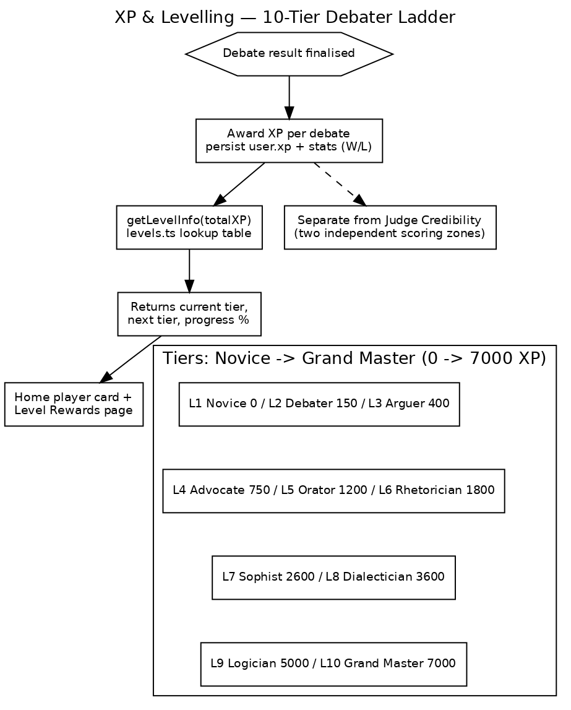

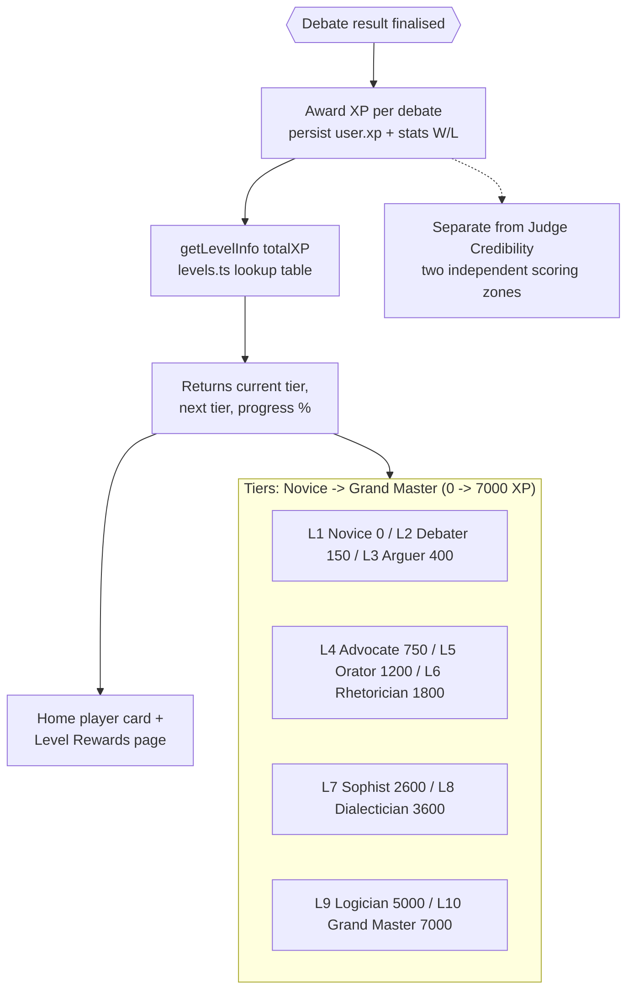
```mermaid
flowchart TD
    End{{"Debate result finalised"}}
    Award["Award XP per debate<br/>persist user.xp + stats W/L"]
    Calc["getLevelInfo totalXP<br/>levels.ts lookup table"]
    Tier["Returns current tier,<br/>next tier, progress %"]
    Sep["Separate from Judge Credibility<br/>two independent scoring zones"]
    UI["Home player card +<br/>Level Rewards page"]

    subgraph Ladder["Tiers: Novice -> Grand Master (0 -> 7000 XP)"]
        L1["L1 Novice 0 / L2 Debater 150 / L3 Arguer 400"]
        L2["L4 Advocate 750 / L5 Orator 1200 / L6 Rhetorician 1800"]
        L3["L7 Sophist 2600 / L8 Dialectician 3600"]
        L4["L9 Logician 5000 / L10 Grand Master 7000"]
    end

    End --> Award --> Calc --> Tier --> UI
    Tier --> Ladder
    Award -.-> Sep
```

---

## 12. Pro Subscriptions & Payments

Razorpay drives recurring Pro subscriptions; a HMAC-verified webhook (checked against the raw request body) keeps isPro and subscription status in sync regardless of client behaviour.

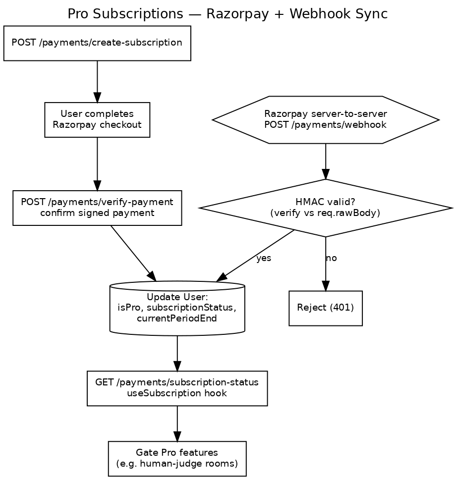

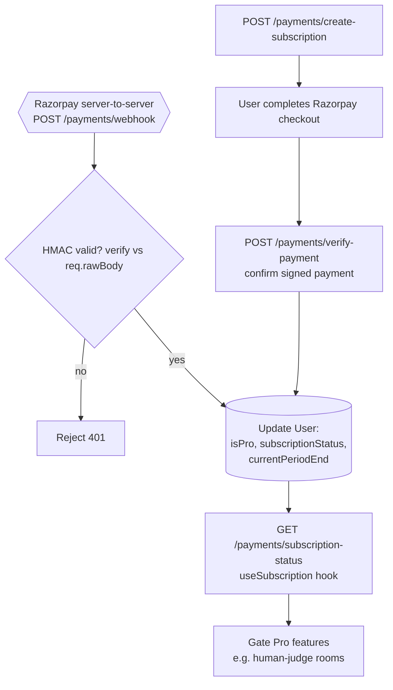
```mermaid
flowchart TD
    Sub["POST /payments/create-subscription"]
    Co["User completes Razorpay checkout"]
    Ver["POST /payments/verify-payment<br/>confirm signed payment"]
    WH{{"Razorpay server-to-server<br/>POST /payments/webhook"}}
    HMAC{"HMAC valid? verify vs req.rawBody"}
    Rej["Reject 401"]
    User[("Update User:<br/>isPro, subscriptionStatus,<br/>currentPeriodEnd")]
    Stat["GET /payments/subscription-status<br/>useSubscription hook"]
    Gate["Gate Pro features<br/>e.g. human-judge rooms"]

    Sub --> Co --> Ver
    Ver --> User
    WH --> HMAC
    HMAC -->|no| Rej
    HMAC -->|yes| User
    User --> Stat --> Gate
```

---
